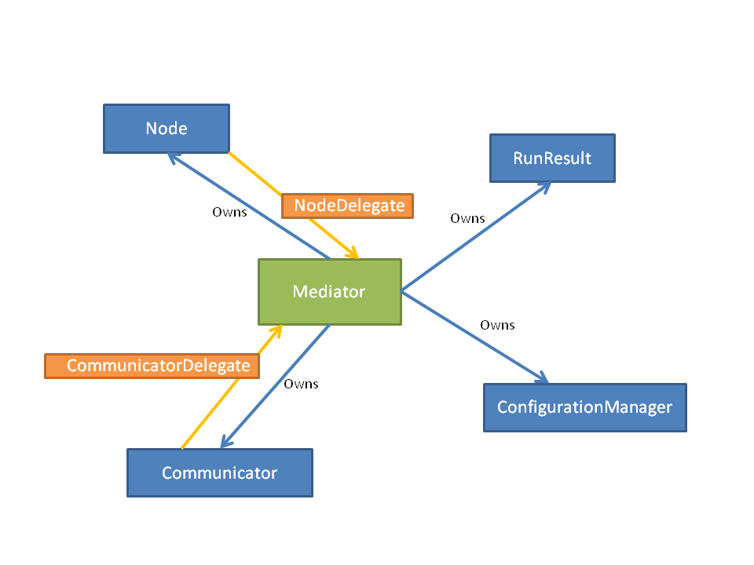

# Repository description and reuse

There are essentially two main parts of this repository - application code and tools. The application code is the implementation of an algorithm, for example ABD or snapshots. It's the code you actually "care" about. The tools are not strictly needed, but they make running and evaluating the application much easier. The tools include `local_starter`, for running the application on your own computer, `remote_starter`, for running the application on remote computers via SSH, and `evaluator`, for evaluting the application code with scenarios and metrics you can customize.

Also check the document `doc/Coding tips.md` for some high-level tips to make the run code faster. This way, the projects can be more homogenous in terms of performance and the way they react to test environments/scenarios.

## Algorithm dependent and independent code

When it comes to the application code, perhaps 10 % is algorithm-independent. This code includes for example:

- Command line arguments handling.
- Communication code.
- "Glue code", i.e., the mediator, client operations and the main function.

Even if merely 10 % is algorithm-independent, it's easy to identify what's not, and the existing code can be very useful and serve as a skeleton that should be easy to adjust to the new algorithm that will be implemented instead.

When it comes to the tools, perhaps 90 % is algorithm-independent. The reason is that how to spawn processes for the code, how to upload files via SSH and so on, is of course completely independent of what algorithm is implemented. There are really only two things that are dependent on the algorithm in the tools:

1. **What arguments the application needs.** Different applications need different arguments when starting a node-instance of it. In ABD, a node needs to know if it should be a writer/reader/both/none. In snapshots, a node also needs to know what an ABD node would need, but also which variant of the snapshots it should run. The arguments to the application affect how the tools invoke the application.

2. **Evaluation.** How to evaluate an algorithm of course depends on the algorithm. For ABD it makes sense to vary the number of readers and writers and record latency. But for URB, it makes sense to vary the window size and number of broadcasters. Hence, the evaluation code changes depending on the algorithm.

## Sharing strategy

Before/unless we come up with a more sophisticated strategy to share the code between projects, I suggest we use the following way. For each project, we copy-paste all code from an existing project. Then the copy is adjusted to the new algorithm. If changes are made to a project, and those changes are done to parts that are algorithm-independent, it can be beneficial to share them with the other projects.

## Application code sharing

The application is built using the Mediator Pattern. We see this in the figure below:

The application consists of many components, including `Node` (the snapshot node), `Communicator`, `RunResult` and `ConfigurationManager`. The Mediator Pattern is used to handle the circular references as easily as possible and keep the code modular. We see that each component only interacts with the `Mediator`, and never directly with another component. Furthermore, the interface to the `Mediator` is well-defined and narrow, specified in an interface for each component. `Node` only needs the functions in the `NodeDelegate` interface and hence has a reference to a `NodeDelegate` and not a `Mediator`.

There are circular references involved here. There are two reasons they appear:

1. `Communicator` needs to call a function on `Node`  (via `Mediator`) when a UDP message appears. However, `Node` also needs to call a function on `Communicator` (via `Mediator`) when it wants to send a message.

2. Currently, `Node` is the only "algorithm"-level component. The snapshot paper only describes one piece of code. This might not be the case for all papers. For example, the RSM paper describes three modules, all of which might need to interact with each other in a circular way.

Note that some components, such as `RunResult` don't call functions on other components. They are only callees. Therefore such components don't need a reference to `Mediator`.

With this overview of the application code in mind, we can see which parts that actually are algorithm-dependent and algorithm-independent, respectively.

- `Communicator` (and `CommunicatorDelegate`) are completely algorithm-independent. Some algorithms might require other ways of communication, for example a reliable broadcast. However, in those cases, that abstraction will still be implemented on top of `Communicator` and can be considered an algorithm itself. `Communicator` is always the lowest layer directly on top of the TCP/IP stack.
- `ConfigurationManger` should in most cases be algorithm-independent. The one exception might be if reconfiguration should be implemented.
- `RunResult` is somewhat algorithm-dependent. What data is recorded of course depends on the algorithm. But some data is always recorded and the general structure of `RunResult` will most likely be the same across algorithms.
- `Node` is completely algorithm-dependent. Inspiration can of course be drawn across algorithms.
- `Mediator` wires all components together and is therefore also algorithm-dependent. But large parts of `Mediator` can probably be reused but just changing the irrelevant parts.

The conclusion is that the various components can be reused to a varying extent. By letting all components interact only via `Mediator` (at least for the "big picture" style of interaction) and by having well-defined interfaces (the `Delegate` ones), reuse will hopefully be facilitated.
